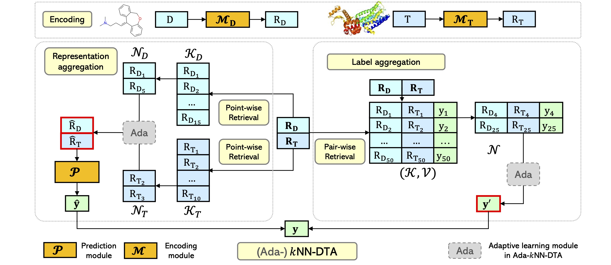

# Boosting Drug-Target Affinity Prediction From Nearest Neighbors

This repository contains the code and data for kNN-DTA: Boosting Drug-Target Affinity Prediction From Neighbors. The code implementation is based on [fairseq](https://github.com/pytorch/fairseq).

## Pipeline Overview



## Requirements and Installation

* pytorch
* fairseq
* faiss-gpu
* rdkit
* numpy

Clone the current repository and fairseq official repository, then merge them:

```shell
git clone git@github.com:kNN-DTA/kNN-DTA.git
cd kNN-DTA
git clone git@github.com:pytorch/fairseq.git
cd fairseq
git checkout 7e75884
cp -frap ../knn_dta/* ./fairseq/
```

Set up the environment using `conda` and install dependencies:

```shell
conda create -n knn_dta python=3.8
conda activate knn_dta
conda install pytorch==1.12.1 torchvision==0.13.1 torchaudio==0.12.1 cudatoolkit=11.3 -c pytorch
conda install -c conda-forge rdkit
conda install -c pytorch faiss-gpu
pip install future scipy scikit-learn lifelines requests tensorboard tensorboardX
```

Install the project from source code:

```shell
pip install -e .
```

## Raw Dataset

* BindingDB Dataset: https://github.com/Shen-Lab/DeepAffinity/tree/master/data/dataset
* DAVIS and KIBA Datasets: https://github.com/kexinhuang12345/DeepPurpose

### Preprocess

You may need to firstly follow the README in `preprocess` folder to process the data from `BindingDB_All.tsv` and downloaded DAVIS and KIBA datasets from Deeppurpose.

```shell
DATADIR=/yourPairedDataDir
DATA_BIN=/yourDataBinDir/bindingdb(davis or kiba)

# Canonicalize all SMILES
python preprocess/canonicalize.py $DATADIR/train.mol --workers 40 \
  --output-fn $DATADIR/train.mol.can

# Tokenize all SMILES
python preprocess/tokenize_re.py $DATADIR/train.mol.can --workers 40 \
  --output-fn $DATADIR/train.mol.can.re 

# Tokenize all protein sequence
python preprocess/add_space.py $DATADIR/train.pro --workers 40 \
  --output-fn $DATADIR/train.pro.addspace

# You should also process the valid set and test set in the same way.

# Binarize the data
fairseq-preprocess \
    --only-source \
    --trainpref $DATADIR/train.mol.can.re \
    --validpref $DATADIR/valid.mol.can.re \
    --testpref $DATADIR/test.mol.can.re \
    --destdir $DATA_BIN/input0 \
    --workers 40 \
    --srcdict preprocess/dict.mol.txt

fairseq-preprocess \
    --only-source \
    --trainpref $DATADIR/train.pro.addspace \
    --validpref $DATADIR/valid.pro.addspace \
    --testpref $DATADIR/test.pro.addspace \
    --destdir $DATA_BIN/input1 \
    --workers 40 \
    --srcdict preprocess/dict.pro.txt

mkdir -p $DATA_BIN/label

cp $DATADIR/train.label $DATA_BIN/label/train.label
cp $DATADIR/valid.label $DATA_BIN/label/valid.label
```

## Pre-training

```shell
export data_path=$DATA_BIN				# processed binary data path
export save_path=yourSavePath
export encoder_layers=16
# 100 epochs. The number of steps changes with different datasets and batch size
export total_steps=35600					# for BindingDB Ki with total bsz 256(32 with 8 GPUs)
export warmup_steps=1782  				# 5% of total_steps
export dataset_name="BindingDB_Ki"
export batch_size=32  						# batch size for a single gpu

bash train_pretrain_model.sh
```

The pre-trained DTA model is trained on 8 NVIDIA Tesla V100 GPUs. Others are trained or evaluated on a single NVIDIA Tesla V100 GPU.

## kNN-DTA

## Build Datastore

You need to build the datastore offline first, and then run kNN-DTA evaluation or Ada-kNN-DTA training and evaluation.

```shell
export data_path=$DATA_BIN
export dstore_path=yourDstorePath
export dataset="BindingDB_Ki"
export ckpt_path=yourCkptPath

bash build_datastore.sh
```

### kNN-DTA Evaluation

```shell
export data_path=$DATA_BIN
export dstore_path=yourDstorePath
export result_path=yourPredictionTSVFile
export ckpt_path=yourCkptPath
export dataset="BindingDB_Ki"
export T=100
export k=32
export l=0.4
export T_mol=1000
export k_mol=8
export l_mol=0.7
export T_pro=1000
export k_pro=8
export l_pro=1

bash evaluate_kNN.sh
```

## Ada-kNN-DTA

### Training

```shell
bash train_adaptive_kNN.sh
```
The training script will only store the last checkpoint for the following evaluation.

### Evaluate

```shell
export data_path=$DATA_BIN
export result_path=yourPredictionTSVFile
export ckpt_path=yourCkptPath
export dataset="BindingDB_Ki"

bash evaluate_adaptive_kNN.sh
```

## Data

To be released...

## Checkpoints

To be released...

## Citation

```latex
@inproceedings{
anonymous2023boosting,
title={Boosting Drug-Target Affinity Prediction from Nearest Neighbors},
author={Anonymous},
booktitle={Submitted to The Eleventh International Conference on Learning Representations },
year={2023},
url={https://openreview.net/forum?id=4K2SRejNGEI},
note={under review}
}
```

## License

This project is licensed under the terms of the MIT license. See [LICENSE](https://github.com/kNN-DTA/kNN-DTA/blob/main/LICENSE) for additional details.